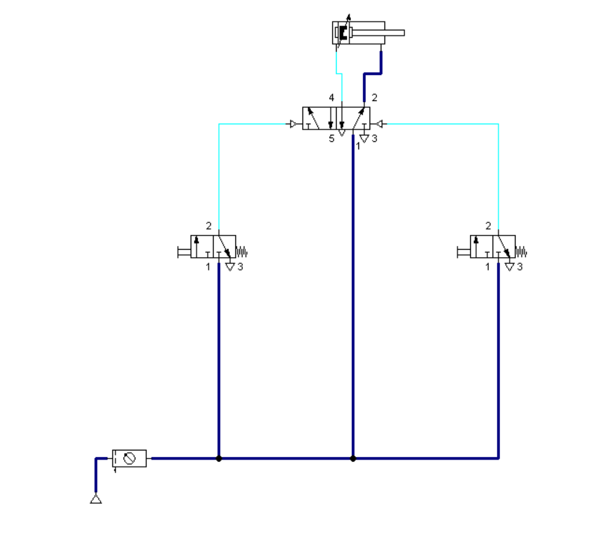

# 🔧 Pneumatic Circuit Simulation — Double-Acting Cylinder Control

A pneumatic circuit designed and simulated in **FluidSIM**, demonstrating the control of a **double-acting cylinder** using a **5/2-way directional control valve** piloted by two **3/2-way valves**.

---

## 📐 Circuit Overview

The circuit models a classic industrial pneumatic control sequence:

| Component | Description |
|---|---|
| Double-acting cylinder | Linear actuator with extend and retract motion |
| 5/2-way directional valve | Main control valve — routes air to extend or retract the cylinder |
| 3/2-way valve (×2) | Pilot signals — each controls one direction of the main valve |
| Pressure source + filter/regulator | Supplies clean, regulated compressed air to the system |

### How it works

1. **Air supply** enters through the filter/regulator unit at the bottom of the circuit.
2. The supply line feeds both **3/2-way pilot valves** (left and right branches).
3. Activating the **left 3/2 valve** sends a pilot signal to one side of the **5/2-way valve**, directing air to **extend** the cylinder.
4. Activating the **right 3/2 valve** sends a pilot signal to the other side, directing air to **retract** the cylinder.
5. Exhaust air is vented through the directional valve's exhaust ports.

---

## 🖼️ Circuit Diagram



---

## 🛠️ Software

- **FluidSIM** (Festo Didactic) — pneumatic simulation software used in industrial training and education
- File format: `.ct` (FluidSIM circuit file)

### To open and run this simulation:

1. Install [FluidSIM](https://www.festo-didactic.com/int-en/services/fluidsim/) (Festo Didactic)
2. Clone or download this repository
3. Open `fluidsim.ct` in FluidSIM
4. Press **Play / Simulate** to run the circuit

---

## 🎯 Learning Objectives

This project demonstrates:

This project demonstrates:
* Understanding of pneumatic circuit design using ISO 1219 symbols
* Correct application of a 5/2-way valve for double-acting cylinder control
* Use of pilot-operated logic via 3/2-way valves
* Proper circuit layout: supply → control → actuator → exhaust

---

## 📚 Concepts Covered

- Directional control valves (3/2-way, 5/2-way)
- Double-acting vs. single-acting cylinders
- Pneumatic pilot signals
- Compressed air supply conditioning (filter, regulator)
- ISO pneumatic schematic symbols

---

## 📁 Repository Structure

```
├── fluidsim.ct          # FluidSIM circuit file
├── circuit_diagram.png  # Exported circuit diagram image
└── README.md            # This file
```

---

## 👤 Author

Feel free to open an issue or reach out if you have questions about the circuit logic.
